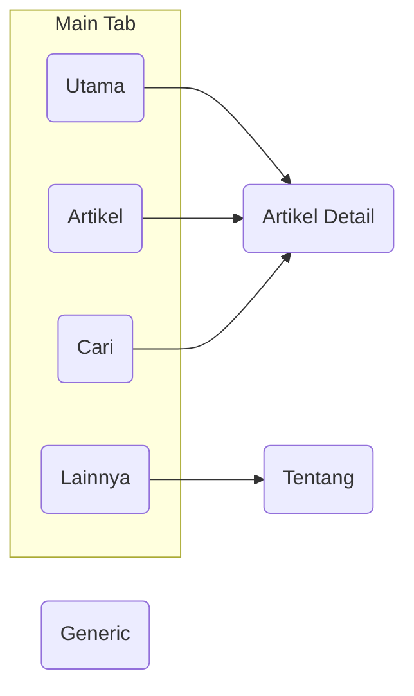

# Screen

## API

#### Utama

Consist of 3 sections:

1. Highlight Article [:material-code-json:](https://buletinpillar.org/wp-json/wp/v2/posts?per_page=4)

    - Api will return 4 articles, take only the first article

2. Newest Articles

    - Same api as Highlight Article but take the last 3 articles

3. Editor Choice :material-code-json: [Example](https://buletinpillar.org/wp-json/wp/v2/posts?pilihan=yes&orderby=modified)

    - Return 3 articles

#### Artikel :material-code-json: [Example](https://buletinpillar.org/wp-json/wp/v2/posts?categories=314&page=1)

Consist of `ScrollableTabRow`, each tab there is an API call.

- Paginated (start from page 1)
- 10 articles per page

#### Cari :material-code-json: [Example](https://buletinpillar.org/wp-json/wp/v2/posts?search=%22doa%22&search_columns=post_title&page=1)

Consist of `TextField` used as keyword input and list of articles.

- Paginated (start from page 1)
- 10 articles per page

#### Artikel Detail [Example](https://buletinpillar.org/wp-json/wp/v2/posts/123)

Consist of an article shown in detail

## Resources

[Figma Prototype](https://www.figma.com/proto/cyX3QMOpe7HDql6BLK9Y1K/Bulletin-Pillar?node-id=60%3A317&starting-point-node-id=60%3A317)
